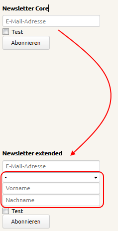
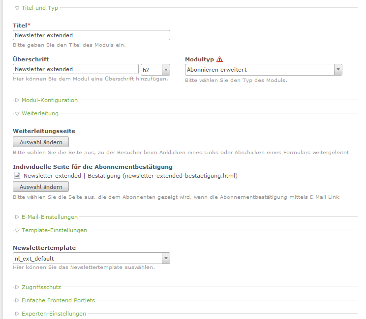

# Contao Extension: hofff.com - Newsletter extended

Provides extended newsletter functionality for Contao Open Source CMS.

## Features

1. Offers a special subscribe module (`Subscribe extended`)
    - with optional entering of salutation, first & last name
    - with defining a custom page for activation confirmation

## Compatibility

- min. Contao version: >= 3.2.0
- max. Contao version: <  3.6.0

## Dependency

This extension is dependent on the following extensions:

- newsletter (Contao core)

## Screenshots

